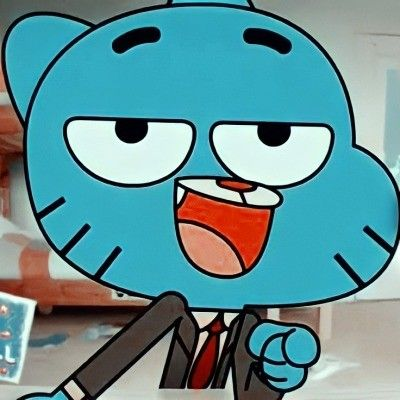

# xenthrall

 

  

 

### Currently building

`atlas`  ·  `nexo`  ·  `faro`

Tres cosas en marcha por ahora.

 

*"I don’t know what I’m building toward yet. I’m curious enough to find out."*

 

 

